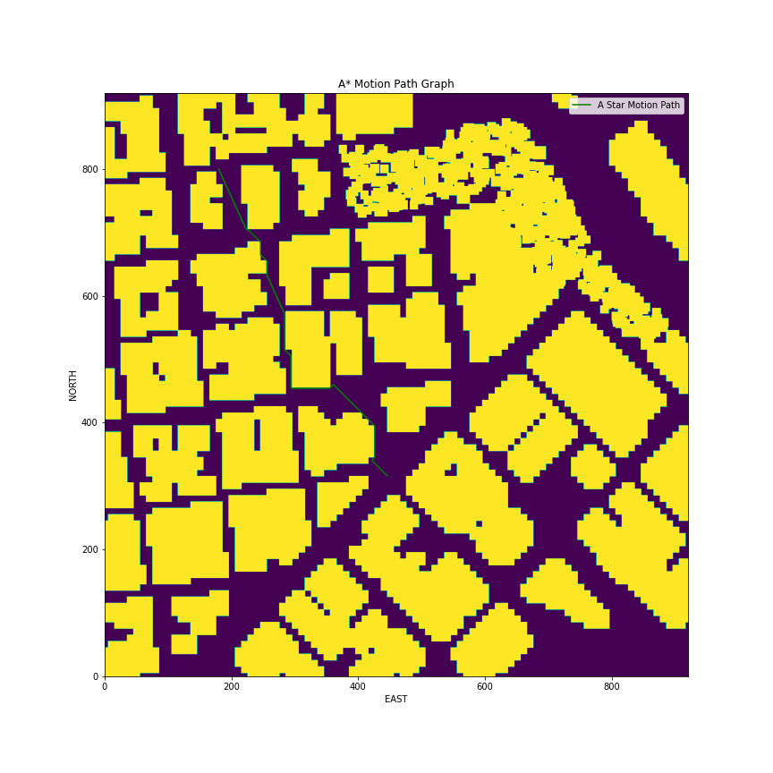

## FCND-Term1-P2-3D-Motion-Planning

This project is part of [Udacity](https://www.udacity.com "Udacity - Be in demand")'s [Flying Car Nanodegree](https://www.udacity.com/course/flying-car-nanodegree--nd787).  The project is to integrate the technique, such as A Star Search and Voronoi Map, that learned throughout the last several lessons to plan a 3D path through an urban environment.   The python code communicates with Udacity FCND Simulator using Udacidrone API on Mac Mini 1.  The project is using Miniconda with Python 3.6.1

---

# Project Description
The project mainly to develop a class method named plan_path() to execute the action below:
1. Load the 2.5D map in the colliders.csv file describing the environment.
2. Discretize the environment into a grid or graph representation.
3. Define the start and goal locations.
4. Perform a search using A* , Voronoi or other search algorithm.
5. Use a collinearity test or ray tracing method (like Bresenham) to remove unnecessary waypoints.
6. Return waypoints in local ECEF coordinates.

## Implementation
The motion planning is built mainly relied on the algorithm of A* Search.  However, I also provided an alternatively method, that is Voronoi Diagram.  The motion path built by A* Search usually get the shorter path.  However, the motion path got from Voronoi diagram is usually safer because the path is always at the middle of the obstacles.  The following is the diagrams for the motion path that planned under the algorithm of A* Search and Voronoi Diagram respectively.

## [Rubric](https://review.udacity.com/#!/rubrics/1534/view) Points

### Explain the Starter Code

#### The starter code contains two files :`motion_planning.py` and planning_utils.py
The script of motion_planning.py contains a basic planning implementation that includes the setup of states for drone and callback routines for the operation handshaking between the drone and the computer.

The script of planning_utils.py provides the utilities of grid creation, A Star Research and also some prune utilities like collinearity.

### Implementing Path Planning Algorithm

#### 1. Set the global home position
We need to read the first line of the csv file, extract lat0 and lon0 as floating point values and use the self.set_home_position() method to set global home. 
			
 &nbsp;&nbsp;&nbsp;&nbsp;&nbsp;&nbsp;&nbsp;&nbsp;&nbsp;&nbsp;&nbsp;&nbsp;&nbsp;&nbsp;F1 = open('colliders.csv', 'r')
&nbsp;&nbsp;&nbsp;&nbsp;&nbsp;&nbsp;&nbsp;&nbsp;&nbsp;&nbsp;&nbsp;&nbsp;&nbsp;&nbsp;S1 = F1.readline(-1)
&nbsp;&nbsp;&nbsp;&nbsp;&nbsp;&nbsp;&nbsp;&nbsp;&nbsp;&nbsp;&nbsp;&nbsp;&nbsp;&nbsp;S2, S3 = S1.split(", ")
&nbsp;&nbsp;&nbsp;&nbsp;&nbsp;&nbsp;&nbsp;&nbsp;&nbsp;&nbsp;&nbsp;&nbsp;&nbsp;&nbsp;_, S4 = S2.split()
&nbsp;&nbsp;&nbsp;&nbsp;&nbsp;&nbsp;&nbsp;&nbsp;&nbsp;&nbsp;&nbsp;&nbsp;&nbsp;&nbsp; _, S5 = S3.split()
            &nbsp;&nbsp;&nbsp;&nbsp;&nbsp;&nbsp;&nbsp;&nbsp;&nbsp;&nbsp;&nbsp;&nbsp;&nbsp;&nbsp;lat0 = float(S4)
            &nbsp;&nbsp;&nbsp;&nbsp;&nbsp;&nbsp;&nbsp;&nbsp;&nbsp;&nbsp;&nbsp;&nbsp;&nbsp;&nbsp;lon0 = float(S5)
            &nbsp;&nbsp;&nbsp;&nbsp;&nbsp;&nbsp;&nbsp;&nbsp;&nbsp;&nbsp;&nbsp;&nbsp;&nbsp;&nbsp;self.set_home_position(lon0, lat0, 0)

#### 2. Set the current local position
We then can get the global current position of the drone from the class variable: _longitude, _latitude and _altitude.  With the help of function global_to_local(),  we can easily convert the global current position to current local position.
 &nbsp;&nbsp;&nbsp;&nbsp;&nbsp;&nbsp;&nbsp;&nbsp;&nbsp;&nbsp;&nbsp;&nbsp;&nbsp;&nbsp; global_pos_current= [self._longitude, self._latitude, self._altitude]
&nbsp;&nbsp;&nbsp;&nbsp;&nbsp;&nbsp;&nbsp;&nbsp;&nbsp;&nbsp;&nbsp;&nbsp;&nbsp;&nbsp; local_pos_current= global_to_local(global_pos_current, self.global_home)

#### 3. Set grid start position from local position
We then create a grid with the help of create_grid_and_edges() function.  The grid start can be any point inside the grid but cannot be inside the obstacles.
 &nbsp;&nbsp;&nbsp;&nbsp;&nbsp;&nbsp;&nbsp;&nbsp;&nbsp;&nbsp;&nbsp;&nbsp;&nbsp;&nbsp;grid, edges, north_offset, east_offset = create_grid_and_edges(data, TARGET_ALTITUDE, SAFETY_DISTANCE)
&nbsp;&nbsp;&nbsp;&nbsp;&nbsp;&nbsp;&nbsp;&nbsp;&nbsp;&nbsp;&nbsp;&nbsp;&nbsp;&nbsp; grid_start= (int(np.ceil(self.local_position[0] - north_offset)), int(np.ceil((self.local_position[1] - east_offset))))

#### 4. Set grid goal position from geodetic coords
The desired goal location should be able to choose any (lat, lon) within the map and have it rendered to a goal location on the grid.  Of course, the goal position cannot be inside the obstacles.
 &nbsp;&nbsp;&nbsp;&nbsp;&nbsp;&nbsp;&nbsp;&nbsp;&nbsp;&nbsp;&nbsp;&nbsp;&nbsp;&nbsp; grid_goal= (int(np.ceil(-north_offset + 500)), int(np.ceil(-east_offset + 300)))

#### 5. Modify A* to include diagonal motion (or replace A* altogether)
To include the diagonal motion in A* search,  beside NORTH,  EAST,  SOUTH and NORTH, we need to add four more orientations that is NORTH_EAST, SOUTH_EAST, SOUTH_WEST and NORTH_EAST.
 
    &nbsp;&nbsp;&nbsp;&nbsp;&nbsp;&nbsp;&nbsp;&nbsp;&nbsp;&nbsp;&nbsp;&nbsp;&nbsp;&nbsp;NORTH_WEST = (-1, -1, sqrt(2))
    &nbsp;&nbsp;&nbsp;&nbsp;&nbsp;&nbsp;&nbsp;&nbsp;&nbsp;&nbsp;&nbsp;&nbsp;&nbsp;&nbsp;NORTH_EAST = (-1, 1, sqrt(2))
    &nbsp;&nbsp;&nbsp;&nbsp;&nbsp;&nbsp;&nbsp;&nbsp;&nbsp;&nbsp;&nbsp;&nbsp;&nbsp;&nbsp;SOUTH_EAST = (1, 1, sqrt(2))
    &nbsp;&nbsp;&nbsp;&nbsp;&nbsp;&nbsp;&nbsp;&nbsp;&nbsp;&nbsp;&nbsp;&nbsp;&nbsp;&nbsp;SOUTH_WEST = (1, -1, sqrt(2))
&nbsp;&nbsp;&nbsp;&nbsp;&nbsp;&nbsp;&nbsp;&nbsp;&nbsp;&nbsp;&nbsp;&nbsp;&nbsp;&nbsp;						    :
&nbsp;&nbsp;&nbsp;&nbsp;&nbsp;&nbsp;&nbsp;&nbsp;&nbsp;&nbsp;&nbsp;&nbsp;&nbsp;&nbsp;						    :
    &nbsp;&nbsp;&nbsp;&nbsp;&nbsp;&nbsp;&nbsp;&nbsp;&nbsp;&nbsp;&nbsp;&nbsp;&nbsp;&nbsp;#SOUTH_EAST		
&nbsp;&nbsp;&nbsp;&nbsp;&nbsp;&nbsp;&nbsp;&nbsp;&nbsp;&nbsp;&nbsp;&nbsp;&nbsp;&nbsp;    if x + 1 > n or y + 1 > m or grid[x+1, y+1] = = 1:
        &nbsp;&nbsp;&nbsp;&nbsp;&nbsp;&nbsp;&nbsp;&nbsp;&nbsp;&nbsp;&nbsp;&nbsp;&nbsp;&nbsp; &nbsp;&nbsp;&nbsp;&nbsp;&nbsp;&nbsp;valid_actions.remove(Action.SOUTH_EAST)
    &nbsp;&nbsp;&nbsp;&nbsp;&nbsp;&nbsp;&nbsp;&nbsp;&nbsp;&nbsp;&nbsp;&nbsp;&nbsp;&nbsp;#NORTH_EAST
   &nbsp;&nbsp;&nbsp;&nbsp;&nbsp;&nbsp;&nbsp;&nbsp;&nbsp;&nbsp;&nbsp;&nbsp;&nbsp;&nbsp; if x - 1 < 0 or y + 1 > m or grid[x-1, y+1] = = 1:
        &nbsp;&nbsp;&nbsp;&nbsp;&nbsp;&nbsp;&nbsp;&nbsp;&nbsp;&nbsp;&nbsp;&nbsp;&nbsp;&nbsp;&nbsp;&nbsp;&nbsp;&nbsp;&nbsp;valid_actions.remove(Action.NORTH_EAST)			
   &nbsp;&nbsp;&nbsp;&nbsp;&nbsp;&nbsp;&nbsp;&nbsp;&nbsp;&nbsp;&nbsp;&nbsp;&nbsp;&nbsp; #SOUTH_WEST
    &nbsp;&nbsp;&nbsp;&nbsp;&nbsp;&nbsp;&nbsp;&nbsp;&nbsp;&nbsp;&nbsp;&nbsp;&nbsp;&nbsp;if x + 1 > n or y - 1 < 0 or grid[x+1, y-1] = = 1:
        &nbsp;&nbsp;&nbsp;&nbsp;&nbsp;&nbsp;&nbsp;&nbsp;&nbsp;&nbsp;&nbsp;&nbsp;&nbsp;&nbsp;&nbsp;&nbsp;&nbsp;&nbsp;&nbsp;valid_actions.remove(Action.SOUTH_WEST)
    &nbsp;&nbsp;&nbsp;&nbsp;&nbsp;&nbsp;&nbsp;&nbsp;&nbsp;&nbsp;&nbsp;&nbsp;&nbsp;&nbsp;#NORTH_WEST
    &nbsp;&nbsp;&nbsp;&nbsp;&nbsp;&nbsp;&nbsp;&nbsp;&nbsp;&nbsp;&nbsp;&nbsp;&nbsp;&nbsp;if x - 1 < 0 or y - 1 < 0 or grid[x-1, y-1] = = 1:
       &nbsp;&nbsp;&nbsp;&nbsp;&nbsp;&nbsp;&nbsp;&nbsp;&nbsp;&nbsp;&nbsp;&nbsp;&nbsp;&nbsp; &nbsp;&nbsp;&nbsp;&nbsp;&nbsp;&nbsp;valid_actions.remove(Action.NORTH_WEST)	
        

#### 6. Cull waypoints 
To prune the path of unnecessary waypoints, here we use the ray tracing method -- Bresenham.
     &nbsp;&nbsp;&nbsp;&nbsp;&nbsp;&nbsp;&nbsp;&nbsp;&nbsp;&nbsp;&nbsp;&nbsp;&nbsp;&nbsp; pruned_path = [p for p in path]
    &nbsp;&nbsp;&nbsp;&nbsp;&nbsp;&nbsp;&nbsp;&nbsp;&nbsp;&nbsp;&nbsp;&nbsp;&nbsp;&nbsp; i = 0
   &nbsp;&nbsp;&nbsp;&nbsp;&nbsp;&nbsp;&nbsp;&nbsp;&nbsp;&nbsp;&nbsp;&nbsp;&nbsp;&nbsp; while i < len(pruned_path) - 2:
       &nbsp;&nbsp;&nbsp;&nbsp;&nbsp;&nbsp;&nbsp;&nbsp;&nbsp;&nbsp;&nbsp;&nbsp;&nbsp;&nbsp;&nbsp;&nbsp;&nbsp;&nbsp;&nbsp;&nbsp; p1 = pruned_path[i]
       &nbsp;&nbsp;&nbsp;&nbsp;&nbsp;&nbsp;&nbsp;&nbsp;&nbsp;&nbsp;&nbsp;&nbsp;&nbsp;&nbsp;&nbsp;&nbsp;&nbsp;&nbsp;&nbsp;&nbsp; p2 = pruned_path[i + 1]
       &nbsp;&nbsp;&nbsp;&nbsp;&nbsp;&nbsp;&nbsp;&nbsp;&nbsp;&nbsp;&nbsp;&nbsp;&nbsp;&nbsp;&nbsp;&nbsp;&nbsp;&nbsp;&nbsp;&nbsp; p3 = pruned_path[i + 2]
&nbsp;&nbsp;&nbsp;&nbsp;&nbsp;&nbsp;&nbsp;&nbsp;&nbsp;&nbsp;&nbsp;&nbsp;&nbsp;&nbsp;&nbsp;&nbsp;&nbsp;&nbsp;&nbsp;&nbsp;  if  all((grid[cell] == 0) for cell in bresenham(int(p1[0]), int(p1[1]), int(p3[0]), int(p3[1]))):
            &nbsp;&nbsp;&nbsp;&nbsp;&nbsp;&nbsp;&nbsp;&nbsp;&nbsp;&nbsp;&nbsp;&nbsp;&nbsp;&nbsp;&nbsp;&nbsp;&nbsp;&nbsp;&nbsp;&nbsp;&nbsp;&nbsp;&nbsp;&nbsp;&nbsp;&nbsp;pruned_path.remove(p2)
        &nbsp;&nbsp;&nbsp;&nbsp;&nbsp;&nbsp;&nbsp;&nbsp;&nbsp;&nbsp;&nbsp;&nbsp;&nbsp;&nbsp;&nbsp;&nbsp;&nbsp;&nbsp;&nbsp;&nbsp;else:
            &nbsp;&nbsp;&nbsp;&nbsp;&nbsp;&nbsp;&nbsp;&nbsp;&nbsp;&nbsp;&nbsp;&nbsp;&nbsp;&nbsp;&nbsp;&nbsp;&nbsp;&nbsp;&nbsp;&nbsp;&nbsp;&nbsp;&nbsp;&nbsp;&nbsp;&nbsp;i += 1      

### Execute the flight
The following is the video of the Drone flying through the planned motion path with Voronoi  Diagram

### Conclusion
This is a very challenge topic.  Currently,  I just apply A* Search and Voronoi Diagram on the Motion Planning.  The result is very good.  However, such planning is lack of reaction for those ad hoc case, such as some moving objects suddenly jump into the environment.  In the future, I will try to implement more real world planning such as RRT(Rapidly-Exploring Random Tree), potential field planning, receding horizon planning, in order to encounter unexpected obstacles. 
  

